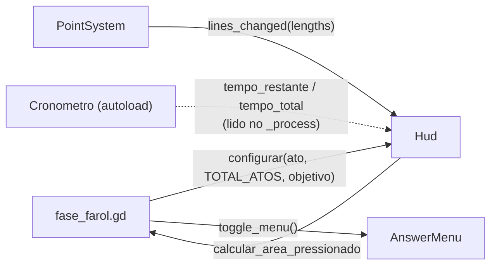

# HUD da fase (CG-38)

O HUD é `src/ui/Hud/hud.tscn`, instanciado na `fase_base_farol.tscn` como `Hud`. Ele segue a opção **E — Farol** do Figma ([arquivo](https://www.figma.com/design/9349TfqUeBPm9beuyaa6sE), página "HUD — CG-38"), com o indicador de ato abaixo do objetivo.

| Elemento | Posição | Critério do CG-38 |
| --- | --- | --- |
| Objetivo | canto superior esquerdo, faixa vermelha "OBJETIVO" + cartão branco | Objetivo do ato em uma frase |
| Ato | abaixo do objetivo: "ATO 2 DE 3" + três listras | Indicador de ato atual |
| Lanterna | topo, centralizada: tempo em `mm:ss` e anel de tempo restante | Cronômetro sempre visível, com destaque no fim |
| Retas | canto superior direito, uma linha por reta com o comprimento | Lista das retas traçadas (CG-19) |
| Calcular área | canto inferior direito, com a tecla Tab | Botão que abre o menu de chute (CG-20) |
| F1 controles | canto inferior esquerdo; segurar F1 abre o painel de controles | Controles acessíveis por uma tecla |
| Moldura de filé | rendas e cantos do painel de controles, malha quadriculada no fundo dele | Identidade visual do filé (CG-39) |

A legibilidade sobre o cenário vem dos cartões brancos opacos (96%) com sombra: o texto nunca fica direto sobre o céu ou a areia.

## De onde vêm os dados

- **Ato e objetivo:** a fase chama `configurar()` no `_ready`. O texto do objetivo é o export `objetivo` de `fase_farol.gd`, preenchido em cada `ato_N_farol.tscn`.
- **Retas:** o `PointSystem` emite `lines_changed` sempre que uma reta é fechada ou apagada (Q não emite, porque a reta em andamento não está na lista). O HUD só formata: duas casas e vírgula (`5,52 m`); os valores guardados têm precisão completa. Acima de `max_retas_visiveis` (8) retas, as mais antigas viram uma linha "+N anteriores". O jogo não calcula a área.
- **Tempo:** o HUD lê o autoload `Cronometro` a cada quadro. O anel usa `tempo_restante / tempo_total`. `tempo_total` é gravado por `Cronometro.iniciar()` e sobrevive à troca de ato.
- **Botão:** o clique emite `calcular_area_pressionado`. A fase chama `AnswerMenu.toggle_menu()`, o mesmo que o Tab faz, e não abre o menu se ele já foi desligado por `_travar_jogo()`. O clique só acontece com o cursor livre (ESC ou menu aberto). Com o mouse capturado, vale o Tab.

## Tempo acabando

Com `tempo_restante <= limite_urgente` (30 s por padrão, export do HUD), a lanterna "acende": o disco fica vermelho com brilho, o anel fica branco e pisca (`piscadas_por_segundo`), e a legenda troca de "TEMPO" para "CORRA!".

## Painel de controles (F1)

A ação `show_controls` (F1) mostra o painel **enquanto estiver pressionada**. O painel escurece o cenário, mas fica por baixo do resto do HUD, então o tempo continua visível. O jogo não pausa. As linhas do painel ficam nas constantes `CONTROLES_ESQUERDA` e `CONTROLES_DIREITA` de `hud.gd`. Se uma tecla mudar no Input Map, atualize essas constantes.

## Camadas de desenho

CanvasLayers com o mesmo `layer` não têm ordem garantida entre si, então cada uma tem a sua:

| Camada | Cena | Por quê |
| --- | --- | --- |
| 1 | `point.tscn` (rótulo da medida) | Fica atrás de toda a interface |
| 2 | `hud.tscn` | O escurecimento do F1 cobre os rótulos das medidas |
| 3 | `answer_menu.tscn` | O menu de chute fica sobre o HUD |
| 4 | `result_screen.tscn` | O resultado fica sobre tudo |

## Medidas

O Figma foi desenhado em 1920×1080. O projeto roda em 1152×648 com `stretch/mode = canvas_items`, então todas as medidas da cena são as do Figma × 0,6 (margem de 40 px → 24, lanterna de 150 → 90, fonte de 54 → 32). Em 1080p o resultado volta ao tamanho do Figma.

## Assets

- Ícones: Lucide (ISC), em `assets/sprites/`. Brancos, coloridos no Godot por `modulate`. Ver [ICON_SOURCES.md](ICON_SOURCES.md).
- Padrões de filé: Hero Patterns (CC BY 4.0, **exige atribuição**), em `assets/sprites/renda_file/`. Ver [ICON_SOURCES.md](ICON_SOURCES.md).
- Fontes: Bebas Neue e Barlow (OFL 1.1), em `assets/fonts/`. Ver [FONT_SOURCES.md](FONT_SOURCES.md).
- O anel da lanterna é desenhado com `draw_arc` em `lanterna_anel.gd`. Painéis e botões são `StyleBoxFlat`.
