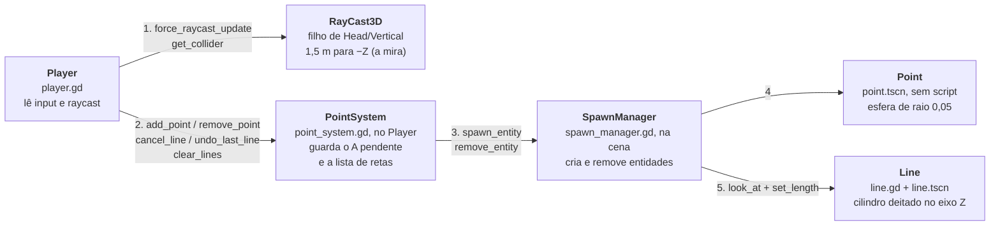

# Sistema de pontos — PointSystem e SpawnManager

O jogador ancora dois pontos em superfícies com colisão e o jogo traça uma reta entre eles, guardando o comprimento em metros (1 unidade = 1 metro). O **PointSystem** decide o que criar e apagar; o **SpawnManager** só executa. O **Player** lê o input e chama as funções públicas do PointSystem.

## Controles

| Tecla | Ação no Input Map | Função chamada | Efeito |
| --- | --- | --- | --- |
| Clique esquerdo | `left_click_mouse` | `add_point(posição)` | Ancora o ponto A; se já houver um A, fecha a reta no ponto B |
| Clique direito | `right_click_mouse` | `remove_point(ponto)` | Apaga o ponto mirado e a reta a que ele pertence |
| Q | `cancel_line` | `cancel_line()` | Cancela a reta em andamento (apaga o ponto A) |
| E | `clear_lines` | `undo_last_line()` | Desfaz a última reta fechada |
| Ctrl + E | `undo_line` | `clear_lines()` | Apaga todas as retas e a reta em andamento |

Os nomes das ações de E e Ctrl + E estão trocados em relação às funções que chamam (ver [Pontos de atenção](#pontos-de-atenção)). O comportamento no jogo está correto.

## Visão geral



Pontos e retas são filhos da cena atual, não do SpawnManager. O único estado do sistema fica no PointSystem.

## Player: leitura do input

O bloco fica no fim de `_physics_process` em `src/entities/player/player.gd` e roda em duas partes.

**Ações que não dependem da mira** (Q, E, Ctrl + E) são checadas antes do raycast, então funcionam mirando em qualquer lugar:

1. Q chama `cancel_line()`.
2. Ctrl + E chama `clear_lines()`.
3. Senão, E com `exact_match = true` chama `undo_last_line()`. O `exact_match` impede que o E dispare quando o Ctrl está pressionado, e o `elif` garante que as duas não rodem no mesmo frame.

**Ações que dependem da mira** (cliques):

1. `raycast.force_raycast_update()` recalcula o raio no frame atual. Sem isso, o Player lê o resultado do frame anterior, que pode apontar para um ponto já apagado (`get_collider()` volta `null` e o jogo quebra).
2. Se o raio não acertou nada, os cliques são ignorados.
3. `target` é o `owner` do collider: o raio acerta a `Area3D` interna do ponto, mas o grupo `Iteráveis` fica no nó raiz `Point`.
4. **Clique esquerdo:** só cria ponto se o collider **não** for `Area3D`. Pontos e retas são `Area3D`, então clicar em cima deles não cria ponto novo; chão e Farol são corpos e aceitam o ponto.
5. **Clique direito:** se `target` estiver no grupo `Iteráveis`, chama `remove_point(target)`.

## PointSystem

Fica no nó `Head/Vertical/PointSystem` de `player.tscn`, com o script `src/scripts/point_system.gd`.

| Membro | Tipo | Papel |
| --- | --- | --- |
| `POINT_SCENE` | const PackedScene | `point.tscn` |
| `LINE_SCENE` | const PackedScene | `line.tscn` |
| `MIN_LINE_LENGTH` | const float | 0,001 m; abaixo disso não existe reta |
| `sp` | SpawnManager | achado por `$"../../../../SpawnManager"`, que sobe Vertical → Head → Player → raiz da cena |
| `has_a_point` | bool | verdadeiro enquanto há uma reta em andamento |
| `point_a` | Node3D | o ponto A pendente (`null` sem reta em andamento) |
| `point_a_position` | Vector3 | posição global de A |
| `lines` | Array[Dictionary] | retas fechadas, **em ordem de criação** |

Cada item de `lines` guarda a reta, seus dois pontos e o comprimento:

```gdscript
{"line": Node3D, "a": Node3D, "b": Node3D, "length": float}
```

### Funções públicas

**`add_point(point_position)`** — clique esquerdo.

- Sem A pendente: cria o ponto, guarda como A e liga `has_a_point`.
- Com A pendente: calcula o comprimento L entre A e B. Se L ≤ `MIN_LINE_LENGTH` (B em cima de A), ignora o clique e A continua esperando. Senão, cria o ponto B e a reta no ponto médio M, adiciona o registro ao fim de `lines` e zera o estado de reta em andamento.

**`cancel_line()`** — Q. Se houver A pendente, apaga o ponto e zera `has_a_point` e `point_a`. Sem A, não faz nada.

**`undo_last_line()`** — E. Apaga o último item de `lines`: a reta e os dois pontos. Com a lista vazia, não faz nada. Não mexe no A pendente (para isso existe o Q).

**`clear_lines()`** — Ctrl + E. Chama `cancel_line()`, apaga reta e pontos de todos os itens de `lines` e esvazia a lista.

**`remove_point(point)`** — clique direito.

- Se `point` for o A pendente, equivale a `cancel_line()`.
- Senão, procura em `lines` o registro com esse ponto como A ou B e apaga a reta **e os dois pontos**. Não sobra ponto solto na cena.

**`get_last_line_length()`** — devolve o comprimento da última reta fechada, em metros (0 se não houver). É o ponto de entrada para a futura exibição em `Label3D`; o comprimento de qualquer reta também está em `lines[i]["length"]`.

### Matemática da reta

Com A = `point_a_position` e B = posição do segundo clique. O comprimento é a distância entre A e B, calculado com `A.distance_to(B)`:

$$
L = \lVert B - A \rVert = \sqrt{(B_x - A_x)^2 + (B_y - A_y)^2 + (B_z - A_z)^2}
$$

O centro da reta é o ponto médio, calculado com `A.lerp(B, 0.5)`:

$$
M = \frac{A + B}{2}
$$

A reta é sempre um segmento reto entre A e B, mesmo em superfície curva.

## SpawnManager

Fica na raiz de `test_trace_lines.tscn` (instância de `spawn_manager.tscn`), com o script `src/scripts/spawn_manager.gd`. Não decide nada: cria e remove o que o PointSystem pedir.

### `spawn_entity(entity, spawn_position, entity_length = null, destiny = null) -> Node3D`

| Parâmetro | Para o ponto | Para a reta |
| --- | --- | --- |
| `entity` | `POINT_SCENE` | `LINE_SCENE` |
| `spawn_position` | posição clicada | ponto médio M |
| `entity_length` | (omitido) | comprimento L |
| `destiny` | (omitido) | ponto B |

1. **`entity.instantiate()`** cria a instância, ainda fora da árvore.
2. **`get_tree().current_scene.add_child(new_entity)`** coloca na raiz da cena atual. Nesse momento o `_ready` da entidade roda.
3. **`global_position = spawn_position`** posiciona. Vem depois do `add_child` porque a posição global depende da árvore.
4. **Só com comprimento e destino:** calcula a direção de M até B. Se ela for quase paralela a `Vector3.UP` (produto escalar em módulo acima de 0,99), usa `Vector3.RIGHT` como "para cima", porque o `look_at` falha com direção paralela ao vetor de referência.
5. **`look_at(destiny, up)`** gira a entidade para que o −Z dela aponte para B.
6. **`set_length(entity_length)`** delega o tamanho para a própria entidade.
7. **Retorna a entidade**, que o PointSystem guarda em `lines`.

### `remove_entity(entity)`

Chama `queue_free()` se a entidade ainda for válida. Quem decide o que apagar é o PointSystem.

## Line e Point

A estrutura de `line.tscn`:

```text
Line (Node3D, line.gd)
└── Area3D
    ├── LineMesh (MeshInstance3D, CylinderMesh, raio 0,02)          rotação X = 90°
    └── LineCollision (CollisionShape3D, CylinderShape3D, raio 0,02)  rotação X = 90°
```

- **Rotação de 90° em X:** o cilindro do Godot é comprido no eixo Y. Girando os filhos, o comprimento fica no Z do nó `Line`, o eixo que o `look_at` aponta.
- **`_ready` duplica malha e shape:** sub-recursos de um `.tscn` são compartilhados entre instâncias. Sem o `duplicate()`, mudar a altura de uma reta mudaria a de todas.
- **`set_length(length)`:** a malha recebe o comprimento inteiro, de centro a centro dos pontos. O colisor recebe `length − 2 × POINT_RADIUS` (mínimo 0,01), para terminar na superfície de cada ponto e não bloquear o clique direito neles.
- **Por que não usar `scale`:** o Jolt não aceita escala não uniforme em cilindros e troca por outra escala, deixando o colisor do tamanho errado.

O **Point** não tem script: é uma esfera vermelha de raio 0,05 (malha e colisor) dentro de uma `Area3D`, com o nó raiz no grupo `Iteráveis`.

## Tabela de chamadas

| Quem chama | Chamada | Argumentos | Quando |
| --- | --- | --- | --- |
| Player | `ps.cancel_line()` | — | Q |
| Player | `ps.clear_lines()` | — | Ctrl + E |
| Player | `ps.undo_last_line()` | — | E sem modificador |
| Player | `raycast.force_raycast_update()`, `get_collider()` | — | todo frame de física |
| Player | `ps.add_point()` | posição clicada | clique esquerdo em um corpo |
| Player | `ps.remove_point()` | nó `Point` | clique direito em um ponto |
| PointSystem | `sp.spawn_entity()` | `POINT_SCENE`, posição | ponto A ou B |
| PointSystem | `sp.spawn_entity()` | `LINE_SCENE`, M, L, B | segundo clique, se L > 0,001 |
| Godot | `Line._ready()` | — | durante o `add_child` da reta |
| SpawnManager | `new_entity.look_at()` | B, up | só com comprimento e destino |
| SpawnManager | `new_entity.set_length()` | L | só com comprimento e destino |
| PointSystem | `sp.remove_entity()` | reta ou ponto | cancelar, desfazer, apagar todas, remover ponto |

## Pontos de atenção

- **O raio não acerta o Farol:** `farol.gd` coloca os `StaticBody3D` das cascas só na camada de colisão 2, e o `RayCast3D` enxerga só a camada 1 (máscara padrão). Hoje só é possível marcar pontos no chão. Superfícies curvas (Atos 2 e 3) estão em discussão em um card próprio.
- **Reta dentro de superfície curva:** uma reta entre dois pontos de um cilindro passa por dentro dele e fica escondida pela malha do Farol. A forma de exibir está em aberto.
- **Nomes das ações trocados:** no Input Map, `clear_lines` é o E e `undo_line` é o Ctrl + E, o inverso das funções que chamam. Funciona porque o `player.gd` está trocado na mesma medida, mas confunde quem ler.
- **Caminho fixo até o SpawnManager:** `$"../../../../SpawnManager"` exige o Player na raiz da cena e um SpawnManager irmão dele. A cena principal (`test_player_movement.tscn`) não tem SpawnManager: rodando com F5, o primeiro clique dá erro.
- **Nomes internos da reta:** `line.gd` procura `$Area3D/LineMesh` e `$Area3D/LineCollision`. Renomear esses nós quebra o `_ready`.
- **Raio do ponto repetido:** `POINT_RADIUS` em `line.gd` precisa acompanhar o raio definido em `point.tscn`.
- **`set_length` obrigatório:** qualquer cena passada ao `spawn_entity` com comprimento e destino precisa ter esse método.
- **Troca de ato não limpa a cena:** pontos e retas de um ato continuam visíveis quando o `ato` do Farol muda.
- **Alcance de 1,5 m:** o jogador precisa estar a menos de 1,5 m da superfície para marcar um ponto.
